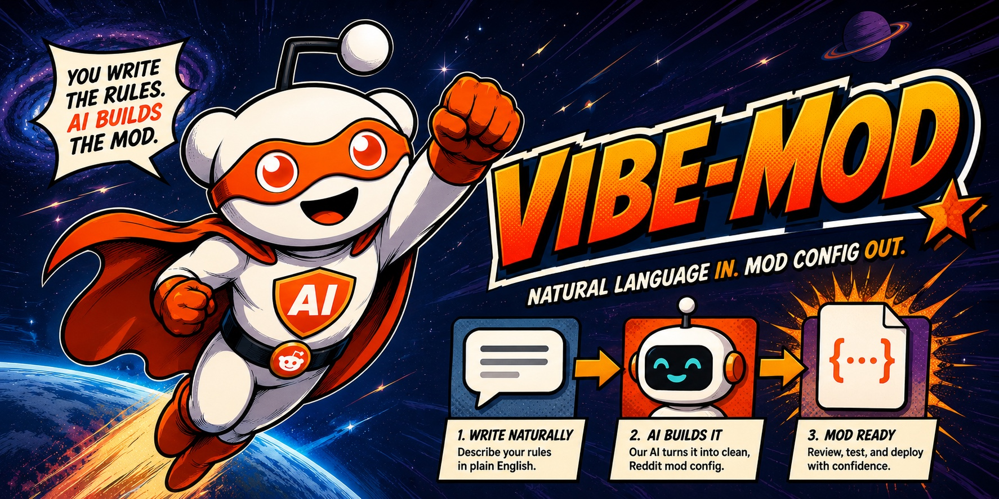

<div align="center">



<strong>Write a moderation rule in plain English.<br>It runs deterministically — shadow-tested first, with one-click undo.</strong>

[](https://github.com/Two-Weeks-Team/vibe-mod/actions/workflows/ci.yml)
[](./LICENSE)
[](https://developers.reddit.com/apps/vibe-mod)
&nbsp;·&nbsp; Built on [Reddit Devvit](https://developers.reddit.com/)

</div>

> A moderator types _"Send to mod queue any post under 50 characters from accounts less than 7 days old."_
> vibe-mod turns that sentence into a real rule, runs it in **24-hour shadow mode** (logging what it
> _would_ do, acting on nothing), shows a **preview** against recent posts, and keeps **30-day undo** on
> every action it takes. The AI is used **only when you write a rule** — never on your community's posts.

## What it does

Type a moderation rule in plain English — _"remove posts whose title is ALL CAPS"_, _"send links from
accounts under 7 days old to the mod queue"_ — and vibe-mod turns it into a real, working rule. It shows
you exactly what the rule will do, runs it quietly for 24 hours first, and lets you undo any action for 30
days. **No YAML, no regex, no code.**

The AI only ever reads the sentence _you_ type — never your community's posts, comments, or usernames.
Once it has written the rule, the AI is done: every check after that is plain, deterministic logic, so the
same post always gets the same decision, and there's **zero AI cost per post**.

## How to use it

1. Install **vibe-mod** on your subreddit from the [App Directory](https://developers.reddit.com/apps/vibe-mod).
2. **Mod Tools → "vibe-mod: Compose rule"** → type your rule → **Compile + Preview**. (If your sentence is
   ambiguous, vibe-mod asks a quick clarifying question instead of guessing.)
3. Review the **dry-run preview** — which of your recent posts the rule would have caught. Nothing happens yet.
4. **Activate** it. The rule runs in **24-hour shadow mode** (just logging what it would do), then goes
   live automatically. Watch those decisions under _"vibe-mod: View rules + log"_.
5. If it ever acts on something you disagree with, open that item's `⋯` menu → **"vibe-mod: Undo this
   action"** (available for 30 days).

Six starter rules are seeded as drafts on install so you have something to look at, and the mod team gets a
one-time welcome message with a 3-step start guide.

## Settings you can tune (per subreddit)

- **Dry-run only** — master off-switch; rules log but never take real action (on by default until you're ready).
- **Max actions per hour** — a safety brake against a runaway rule.
- **Shadow duration** — how long a new rule observes before going live (default 24 hours).

No OpenAI key and no billing — **vibe-mod covers the AI cost**, up to 50 rule compiles per day per subreddit.

## Why a new rule can't hurt your community

- 🕒 **24-hour shadow mode** — every new rule only _logs_ what it would do for a full day before it can act.
- 👀 **Dry-run preview** — see exactly which recent posts a rule catches _before_ you turn it on.
- ↩️ **30-day undo** — every action vibe-mod takes is reversible with one click.
- 🛑 **Guarded actions** — `report` / `flair` / `lock` / `modqueue` / `remove` are allowed, but
  `ban` / `mute` / `permaban` / `approve` stay blocked unless you explicitly tick a checkbox.
- 🧠 **No AI on your content** — the model only sees the sentence you typed, runs once per rule (never per
  post), and never reads posts, comments, or usernames.

## How it compares to AutoModerator

vibe-mod is **not** an AutoMod natural-language wrapper, and **not** an AI that reads your subreddit and
decides things:

| | **vibe-mod** | **AutoModerator** | **Generic "AI moderation"** |
| --- | --- | --- | --- |
| **Authoring** | plain English + a preview | YAML + regex, no preview | varies |
| **When the AI runs** | once, when you write the rule | n/a | on every post/comment |
| **Per-post cost** | **$0** | $0 | per-post token cost |
| **New-rule safety** | **24h shadow**, then auto-promotes | live immediately | usually live immediately |
| **Undo** | **per-action, 30-day, one click** | none built-in | rare |
| **Sees your content?** | only the sentence you typed | n/a | yes, sent to the model |

The idea: **AI is great at turning intent into a rule, and bad at applying rules consistently.** vibe-mod
uses it only for the first part and uses plain, repeatable logic for the rest.

## Fetch domains

This app makes outbound requests to exactly one external domain:

- **`api.openai.com`** — used **only** when a moderator clicks "Compile" to turn a plain-English sentence
  into a structured rule. It does **not** run on posts or comments, and **Reddit content (post/comment
  bodies, usernames) is never sent** — only the moderator's own typed sentence plus a fixed system prompt.

## Permissions

- `reddit` (scope `moderator`) — to take moderation actions (report / flair / lock / modqueue / remove;
  ban / mute / permaban / approve only with an explicit checkbox) and to send the one-time welcome message.
- `redis` — to store your compiled rules, the audit log, undo tokens, and quota counters.
- `http` (`api.openai.com`) — to compile English rules into structured rules, as above.

<details>
<summary><strong>🔧 How it works (architecture)</strong></summary>

The single load-bearing idea: **build-time AI, runtime determinism.** The model runs exactly once per rule
edit; runtime evaluation is plain TypeScript — no network, no model, fully reproducible.

```
Moderator types a rule
        │  (only the moderator's sentence is sent — never Reddit content)
        ▼
OpenAI gpt-5.4-mini   ──►  JSON  ──►  Zod strict parse + action whitelist  ──►  rules:draft (Redis)
   (build-time only)                         (reject if invalid)
        │  dry-run preview / activate
        ▼
rules:active (Redis)
        │
Reddit triggers (onPostSubmit / onCommentSubmit / onPostReport / onCommentReport / onPostFlairUpdate)
        ▼
Deterministic evaluator (pure TS, 0 network, 0 LLM)  ──►  builds a "fact bag" from the item + author + state
        ▼
Action executor  ──►  shadow? log only  :  live? act + write 30-day undo token + audit entry
        ▲
Scheduler: audit retention (daily) · dry-run replay · shadow-promote check (15 min) · rate-limit breaker (5 min)
```

Guarantees that hold **by construction** (verify in code):

| What | Value | Verify |
| --- | --- | --- |
| LLM calls per post/comment at runtime | **0** (pure-TS evaluator, no network) | [`src/server/evaluator.ts`](./src/server/evaluator.ts) |
| LLM calls per rule | exactly **1**, at edit time | [`src/server/routes/compose.ts`](./src/server/routes/compose.ts) |
| New-rule blast radius for first 24h | **0 live actions** (shadow default on) | `shadow: true` in [`rule-schema.ts`](./src/shared/rule-schema.ts) |
| Live action reversibility | **100% for 30 days** (per-action undo) | [`src/server/executor.ts`](./src/server/executor.ts) |
| Reddit content sent to the LLM | **none** (only the mod's typed sentence) | _Fetch domains_, above |

- **Runtime:** Devvit Web app (Hono server, `@devvit/web`); state in Devvit Redis, scoped per install.
- Multi-rule conflicts are surfaced as a read-only preview in _"vibe-mod: View rules + log"_ (see
  [`docs/conflict-handling.md`](./docs/conflict-handling.md)).

</details>

<details>
<summary><strong>💻 For developers</strong></summary>

```bash
npm install            # installs deps + git hooks (npm ci does NOT work here — esbuild EBADPLATFORM)
npm run typecheck      # tsc --noEmit
npm test               # 236 tests (1 skipped); npm run test:devvit for the @devvit/test harness
npm run acceptance     # G1..G4 exit gates
npm run doctor         # pre-deploy preflight (devvit.json integrity, fetch-domain↔permissions, route parity)
npm run build          # tsc --noEmit && vite build → dist/server/index.cjs (CJS server bundle)
npm run openai:smoketest   # real OpenAI API (needs OPENAI_API_KEY in .env) — model comparison table
npm run dev            # = devvit playtest (needs `devvit login` + `devvit upload` first)
```

| Path | What |
| --- | --- |
| `src/shared/{rule-schema,system-prompt,starter-rules}.ts` | Zod v4 strict schema · gpt-5.4 prompt + few-shot · 6 seed rules |
| `src/server/{evaluator,fact-bag,executor,devvit-helpers}.ts` | deterministic evaluator · fact bag · action executor + audit + undo · `@devvit/web` adapters |
| `src/server/index.ts` + `src/server/routes/*` | Hono entry (re-exports `app`) + menu / form / trigger / scheduler route modules |
| `scripts/{acceptance,devvit-doctor,replay,openai-smoketest}.ts` | the `npm run` tooling |
| `test/` + `vitest.devvit.config.ts` | reusable in-memory Devvit testkit + the official `@devvit/test` config |
| `docs/devvit-setup-guide.md` | how to take this repo to a published Devvit app (wizard → upload → settings → playtest → publish) |
| `assets/icon.png` | the 1024² App Directory icon (`marketingAssets.icon` in `devvit.json`) |

The Devvit runtime (routing/RPC) is verified by `devvit playtest`; everything else is covered by the test
suite + an `npm run acceptance` gate. CI runs lint → format → `tsc` → tests → `@devvit/test` → acceptance →
`vite build` → "server bundle loads" smoke.

</details>

## Privacy & Terms

- [Terms of Service](./docs/tos.md)
- [Privacy Policy](./docs/privacy.md)

## License

[MIT](./LICENSE).
